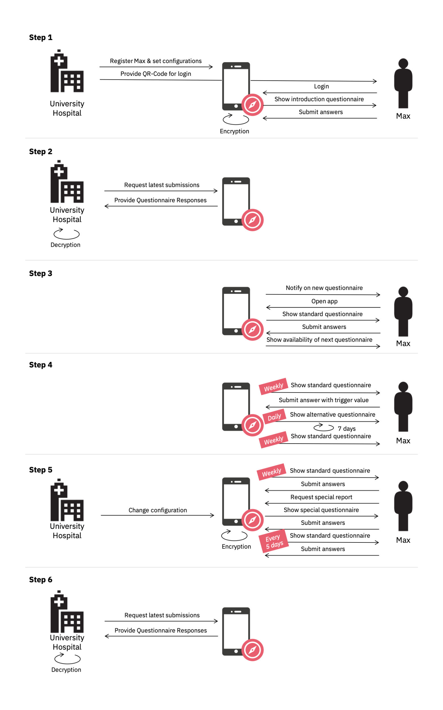

# NUM-App

[General Documentation](./docs)

## About
[Zur Deutschen Version 🇩🇪](#überblick)

The NUM-App is an open source mobile app project for the digital conduct of questionnaire-based studies. The NUM-App is part of [COMPASS](https://num-compass.science/) (Coordination on mobile pandemic apps best practice and solution sharing).

The NUM-App enables the display of [FHIR Questionnaires](https://www.hl7.org/fhir/questionnaire.html) as well as the encrypted transmission and storage of corresponding [FHIR Questionnaire Responses](https://www.hl7.org/fhir/questionnaireresponse.html).

## What is special about the NUM-App?

The NUM-App provides a quick and easy way to digitally conduct questionnaire-based studies. Study participants can fill out questionnaires on their mobile device and submit them when done. The study staff can easily retrieve submitted responses and change questionnaires without the need for participants to reinstall the mobile app. Questionnaire responses are always end-to-end encrypted which enables the use of the NUM-App for medical studies. The app is easily customizable and can be adapted to individual requirements. 

The main advantages of the app are:

* **Open Source**: Everybody can use the app and get involved in the development process.
* **Standard**: The use of the international FHIR standard guarantees the compatability of our app.
* **Community**: The work of our community is guaranteed in the long run, thanks to the subsidy by the [BMBF](https://www.bmbf.de/).
* **Practical**: Our community is supported by domain and techical experts, as we are a [COMPASS](https://num-compass.science/) project of the [NUM-Network](https://www.netzwerk-universitaetsmedizin.de/).
* **Simple**: The app can be set up and customized in a short amount of time, even without a deep technical understanding.

## How to Use

The NUM-App consists of the following three components: 

1. [Mobile Frontend](https://github.com/NUMde/compass-numapp-frontend): An easy to use mobile app (React Native) that can dynamically render FHIR Questionnaires and display information sections. 

2. [Mobile Backend (+ Database)](https://github.com/NUMde/compass-numapp-backend): The backend component which provisions FHIR Questionnaires based on a user context and administrates the storage of FHIR Questionnaire Responses.

3. [Downloader Script](https://github.com/NUMde/compass-numapp-downloader): Use this component to retrieve and decrypt the submitted FHIR Questionnaire Responses.

You need to set up all these components in order to enable the end-to-end usage flow of the NUM-App including the provisioning of a FHIR Questionnaire, the storage of the corresponding response and its retrieval. 
Refer to the documentation files of the linked repositories for information on setup and configuration.

For general documentation on aspects that are component unspecific (e.g. encryption and forking), refer to the [docs](https://github.com/NUMde/compass-numapp/tree/main/docs).

Videos of our recorded enabling sessions can be accessed on [YouTube](https://www.youtube.com/channel/UC_JVfREe2bDR87dPjV7Y8og). A collection of further links to relevant information sources is available [here](https://drive.google.com/file/d/17TCqD8hVgp68FOXxgf0y6n2ms1Q3IBX3/view).

    

## An Illustrative COVID Study Conducted With the NUM-App

The following example illustrates how you can use the NUM-App to digitally conduct your (clinical) studies. We consider Max who participates in a COVID-19 study at a University Hospital.

### Step 1 - Login and the first questionnaire

Max receives a personalized QR-Code from the hospital which he can scan with the NUM-App to log in. He is then presented with a special questionnaire, as it is the first time that he uses the app. The questionnaire includes questions that Max should only answer once. Max completes the questionnaire in one go and submits it. The NUM-App transforms it into a FHIR Questionnaire Response object, encrypts it and transmits it to the mobile backend where it is persisted.

### Step 2 - Retrieval of questionnaire responses

The study staff at the university hospital wants to check if new questionnaire responses were submitted. A staff member runs the downloader script and the encrypted response from Max is retrieved and locally decrypted.

### Step 3 - The standard questionnaire
The study staff defined a questionnaire frequency of seven days. Therefore, Max receives a new standard questionnaire once a week. When he completes one, the NUM-App shows him the time until the next questionnaire becomes available. As Max is not checking the NUM-App every day, a push notification is sent to him once a new questionaire becomes available. The study staff set the time of the notification to 10:00 AM so Max is reminded once a week at that time. As the questionnaire is quite long, Max doesn't always finish it at once. As the NUM-App saves his answers he can always complete the questionnaire at a later time.

### Step 4 - Special answers
At some point in time, Max answers one of the questions with a value that was predefined as a trigger value. In this study this is the information that Max was tested positive for COVID-19. This is detected by the NUM-App. After submission of the questionnaire, Max's profile is automatically adapted based on preconfigured settings. Instead of the standard questionnaire, Max now receives an alternative questionnaire. Also, the questionnaire frequency is increased to once a day and the distribution time of the new questionnaire is set to seven days. That means that Max will receive the new questionnaire daily for one week. After that, the settings are set back to the initial values.

### Step 5 - Submission of a special report
Max is provided the standard questionnaire again. He has already finished most the recent one and has to wait six days for the next to become available. However, one day later he notices COVID-19 symptoms and requests a special report via the app. This again triggers a change of Max's user profile. He will now receive a special questinnaire independent from the regular frequency and can directly report his symptoms via this questionnaire. Afterwards, he will go back to the standard report as not configured otherwise. However, in the meantime the study staff adapted the standard questionnaire frequency to be five days instead of seven, so Max will now receive a questionnaire every five days.

### Step 6 - Retrieval of questionnaire responses
It has been a while since the study staff retrieved the latest questionnaire responses. They execute the downloader script and receive all questionnaire responses that have been submitted by Max since the last retrieval. They also receive an entry about the special report that Max sent. They can process the decrypted responses according to their needs.

## Get Engaged!

Our community lives from active contributions. Take the first step and join our [Meetup group](https://www.meetup.com/de-DE/num-compass) and events.

Gain an impression of our work and take a look at our videos in the [COMPASS YouTube channel](https://www.youtube.com/channel/UC_JVfREe2bDR87dPjV7Y8og).

### License

The NUM-App components are all licensed under the Apache 2.0 license.

### Code of Conduct

We follow the code of conduct defined by the [Contributor Convenant](https://www.contributor-covenant.org/version/2/0/code_of_conduct/).

---

## Überblick
[To the English version 🇬🇧](#about)

Die NUM-App ist ein Open Source Projekt zur Ermöglichung der digitalen Durchführung von Studien auf Basis von Fragebögen. Die NUM-App ist Teil von [COMPASS](https://num-compass.science/) (Coordination on mobile pandemic apps best practice and solution sharing).

Die NUM-App ermöglicht die Darstellung von [FHIR Questionnaires](https://www.hl7.org/fhir/questionnaire.html) sowie die verschlüsselte Versendung und Speicherung der zugehörigen [FHIR Questionnaire Responses](https://www.hl7.org/fhir/questionnaireresponse.html).

## Was ist besonders an der NUM-App?

Die NUM-App ermöglicht eine einfache und digitale Durchführung von Studien auf Basis von Fragebögen. Studienteilnehmer können Fragebögen direkt auf ihrem mobilen Endgerät ausfüllen und versenden. Die Studienverantwortlichen können eingereichte Antworten einfach abrufen und Fragebögen aktualisieren, ohne dass Studienteilnehmer die App neu installieren oder updaten müssen. Fragebogenantworten werden per Ende-zu-Ende-Verschlüsselung an die empfangende Institution übermittelt, wodurch die NUM-App auch für medizinische Studien geeignet ist. Die App ist flexibel personalisierbar und kann auch auf eigene Anforderungen angepasst werden.

Die Hauptvorteile der App sind:

* **Open Source**: Die App kann von jedem genutzt werden und jeder kann sich an der Entwicklung beteiligen.
* **Standard**: Durch die Verwendung des internationalen FHIR Standards wird die Kompatibilität der App sichergestellt.
* **Community**: Dank der Förderung durch das [BMBF](https://www.bmbf.de/) wird die Arbeit unserer Community auch auf lange Sicht sichergestellt.
* **Praxisnah**: Als [COMPASS](https://num-compass.science/) Projekt des [NUM-Netzwerk](https://www.netzwerk-universitaetsmedizin.de/) wird unsere Community durch Fach- und Technikexperten unterstützt.
* **Einfach**: Die App kann auch ohne tiefes technisches Verständnis in kurzer Zeit aufgesetzt und angepasst werden.

## Nutzungshinweis

Die NUM-App umfasst die folgenden drei Komponenten: 

1. [Mobile Frontend](https://github.com/NUMde/compass-numapp-frontend): Eine einfach zu verwendende mobile App (React Native), die FHIR Questionnaires dynamisch darstellen und informative Inhalte anzeigen kann. 

2. [Mobile Backend (+ Database)](https://github.com/NUMde/compass-numapp-backend): Die Backend Komponente, welche die FHIR Questionnaires auf Basis des Nutzerkontexts bereitstellt und die Speicherung der FHIR Questionnaire Responses verwaltet.

3. [Downloader Script](https://github.com/NUMde/compass-numapp-downloader): Diese Komponente dient dem Abruf und der Entschlüsselung eingereichter FHIR Questionnaire Responses.
 
All diese Komponenten müssen aufgesetzt werden, um die Verwendung der App in vollem Umfang zu gewährleisten. Dies beinhaltet die Bereitstellung von FHIR Questionnaires, die Speicherung der zugehörigen Antworten sowie deren Abruf. 

Die Dokumentation der oben verlinkten Repositories bieten weitere Informationen bezüglich Einrichtung und Konfiguration. 

Generelle Inhalte (z.B. Verschlüsselung, Forking etc.), welche übergreifend von Relevanz sind, werden in den [Docs](https://github.com/NUMde/compass-numapp/tree/main/docs) erläutert.

Die aufgezeichneten Videos der Enabling Termine sind auf [YouTube](https://www.youtube.com/channel/UC_JVfREe2bDR87dPjV7Y8og) verfügbar. Eine Sammlung von weiterführenden Links zu relevanten Informationsquellen ist [hier](https://drive.google.com/file/d/17TCqD8hVgp68FOXxgf0y6n2ms1Q3IBX3/view) zu finden.

    

## Eine beispielhafte COVID Studie mit der NUM-App

Das folgende Beispiel illustriert wie eine digitale (klinische) Studie mit der NUM-App durchgeführt werden kann. Wir betrachten dabei Max, der an der COVID-19 Studie einer Universitätsklinik teilnimmt.

### Schritt 1 - Login und der erste Fragebogen

Max erhält von der Klinik einen personalisierten QR-Code, welchen er für den Login in der NUM-App nutzt. Ihm wird nun ein besonderer Fragebogen präsentiert, da es sein erster Appaufruf ist. Der Fragebogen beinhaltet Fragen, die Max nur einmalig beantworten soll. Max füllt den Fragebogen aus und versendet ihn. Die NUM-App wandelt den Fragebogen in eine FHIR Questionnaire Response um, verschlüsselt diese und sendet sie zur Speicherung an das mobile Backend.

### Schritt 2 - Abfrage eingereichter Fragebögen

Das Studienpersonal am Universitätsklinikum möchte überprüfen, ob neue Fragebögen eingereicht wurden. Ein Mitarbeiter führt das Downloader Script aus und erhält die verschlüsselte Questionnaire Response von Max, welche lokal entschlüsselt wird.

### Schritt 3 - Der Standardfragebogen
Das Studienpersonal hat die Fragebogen-Frequenz auf sieben Tage festgelegt. Max erhält daher jede Woche einen neuen Fragebogen. Nachdem er einen eingereicht hat, informiert ihn die NUM-App darüber, wann der nächste Fragebogen zu Verfügung steht. Da Max seine App nicht regelmäßig überprüft, schickt ihm die NUM-App eine Push-Nachricht, sobald ein neuer Fragebogen verfügbar ist. Das Studienpersonal die Benachrichtigungszeit auf 10:00 Uhr festgelegt. Daher erhält Max einmal jede Woche zu dieser Zeit eine Benachrichtigung. Max füllt den Fragebogen nicht immer direkt komplett aus, da dieser sehr lang ist. Da die NUM-App seine Zwischenantworten speichert, kann Max den Fragebogen zu jedem späteren Zeitpunkt fertigstellen.

### Schritt 4 - Besondere Antworten
Zu einem bestimmten Zeitpunkt beantwortet Max eine Frage des Standardfragebogens mit einem Schlüsselwert. In dieser Studie ist dies die Information, dass Max positiv auf COVID-19 getestet wurde. Dies wird durch die NUM-App erkannt. Nach Absenden des Fragebogens wird das Nutzerprofil von Max automatisch auf Basis vorkonfigurierter Werte aktualisiert. Anstatt des Standardfragebogens erhält er nun einen alternativen Fragebogen. Zudem wird die Fragebogen-Frequenz auf einmal pro Tag angehoben und die Verteildauer für den alternativen Fragebogen wird auf sieben Tage gesetzt. Das bedeutet, dass Max für eine Woche täglich den neuen Fragebogen erhält. Danach werden die Einstellungen auf die Standardwerte zurückgesetzt.

### Schritt 5 - Einreichen eines Sonderberichts
Max erhält wieder den Standardfragebogen. Er hat den aktuellsten bereits abgeschickt und muss sechs Tage auf den nächsten warten. Am nächsten Tag bemerkt Max allerdings COVID-19 Symptome und fordert einen Sonderbericht über die App an. Wieder wird sein Nutzerprofil aktualisiert. Max erhält nun einen Spezialfragebogen unabhängig von der üblichen Frequenz und kann seine Symptome direkt über diesen Fragebogen melden. Danach erhält er wieder den Standardfragebogen, da nicht anders konfiguriert. In der Zwischenzeit hat das Studienpersonal jedoch die Fragebogen-Frequenz auf fünf anstatt sieben Tage angehoben. Max erhält den Standardfragebogen daher nun alle fünf Tage.

### Schritt 6 - Abfrage eingereichter Fragebögen
Es ist eine Weile her, dass das Studienpersonal die eingereichten Fragebögen abgerufen hat. Sie führen das Downloader Script aus und erhalten alle von Max versendeten Antworten seit der letzten Abfrage. Sie erhalten außerdem einen Eintrag zum Sonderbericht, den Max angefordert hat. Die entschlüsselten Antworten können nun je nach Anforderung verarbeitet werden.

## Engagiere dich!

Unsere Community lebt von aktivem Engagement. Mach den ersten Schritt und tritt unserer [Meetup Gruppe](https://www.meetup.com/de-DE/num-compass) bei und nimm an den Events teil.

Gewinne einen Eindruck von unserer Arbeit und schau dir unsere Videos im [COMPASS YouTube Channel](https://www.youtube.com/channel/UC_JVfREe2bDR87dPjV7Y8og) an.

### Lizenz

Alle NUM-App Komponenten stehen unter der Apache 2.0 Lizenz.

### Verhaltenskodex

Wir halten uns an den Verhaltenskodex, der durch den [Contributor Convenant](https://www.contributor-covenant.org/version/2/0/code_of_conduct/) festgeschrieben wurde.
