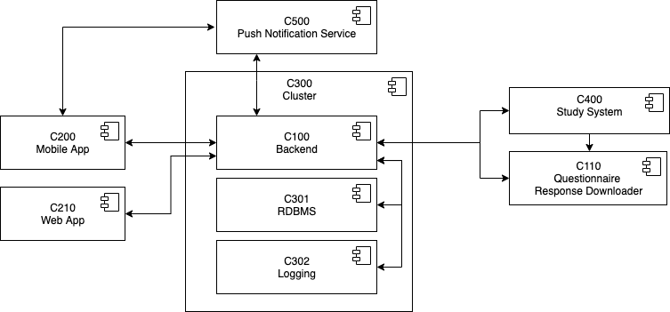
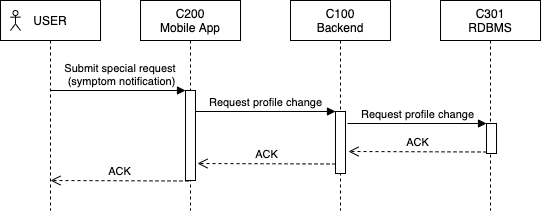
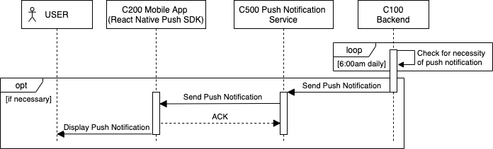
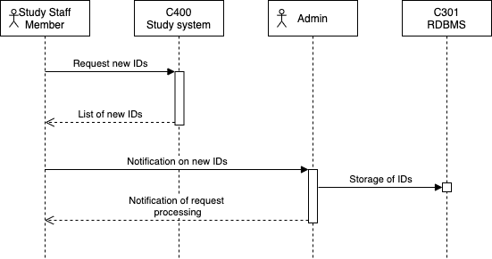

link:../README.adoc[← Table of Contents]

== Architecture

This page provides information on the following topics below:

* <<components,Components>>
* <<component-interactions,Component Interactions>>
* <<logical-operational-model,Logical Operational Model>>
* <<flow-chart,Flow Chart>>

=== Components

C1xx - Backend Components +
C2xx - Frontend Components +
C3xx - Technical Components (Middleware) +
C4xx - University Hospital Specific Components +
C5xx - External Technical Components +

* **C100  Mobile Backend**: The mobile backends acts as a middleware and is used for user authentication as well as the provisioning of FHIR questionnaires.The backend coordinates the distribution of questionnaires and sets their term based on the responses of the test subjects. It handles the storage of questionnaire responses and provides interfaces for their retrieval.

* **C110 Questionnaire Response Downloader**: The downloader retrieves the latest questionnaire response objects and triggers their removal from the database after successful retrieval.

* **C200 Mobile App**: The mobile app allows the user to complete and send FHIR questionnaires after a login. It also displays relevant static information.

* **C300 Cluster**: The cluster is used for the deployment of containerized applications.

* **C301 RDBMS**: Relational database management system that is aimed at storing all data which is processed or generated in the context of the app usage (for example FHIR questionnaires and rules). **Comment**: Some information that is relevant for operation is set by environment  variables.

* **C302 Logging**: Processes are recorded via the logging component which enables the analysis and traceability/reproducibility of error cases.

* **C400 Study System**: The study system provides the identifications of the study participants.

* **C500 Push Notification Service**: The service sends realtime notifications to the mobile app. External Technical Component

=== Component Interactions

The following sequence diagrams represent the interactions between the different components.
They model six use cases:

* <<load-questionnaire,Load Questionnaire>>
* <<submit-questionnaire,Submit Questionnaire>>
* <<send-special-report,Send Special Report>>
* <<send-push-notification,Send Push Notification>>
* <<retrieve-questionnaire-response,Retrieve Questionnaire Response>>
* <<store-study-participant-ids,Store Study Participant IDs>>

==== Load Questionnaire

image:images/UC1_loadQuestionnaire.png[Sequence Diagram UC1 - Load Questionnaire]

$$*$$ A special questionnaire can be retrieved on the initial request (e.g. for one-time query of patient master data). The corresponding questionnaire ID is set in a dedicated variable. If no special questionnaire should be delivered, then the variable can be set to reference the standard questionnaire ID.

==== Submit Questionnaire

image:images/UC2_submitQuestionnaire.png[Sequence Diagram UC2 - Submit Questionnaire]

$$*$$ Questionnaire Response is encrypted with public key of university medicine institution (no access for backend) and local timestamp is added. Also, a set of meta information is added to the response. This data contains masked markers which are used by the backend to determine the ID of the next questionnaire to be received by the user, as well as the next interval duration. This is necessary as the backend is unable to read the encrypted response (as indented).
$$**$$ Timestamp (sent) and unique ID (so Study System can identify response) will be added.

==== Send Special Report

After the backend receives a 200 in response, it will trigger a questionnaire update as pictured in UC1

==== Send Push Notification

==== Retrieve Questionnaire Response

$$*$$ Incl. pagination and cryptographic signature for each (consistency & integrity check) entry with own secret key.

==== Store Study Participant IDs

=== Logical Operational Model

This diagram shows you where deployment units should placed. The diagram comprises execution deployment units (EXXX) and data deployment units (DXXX). Units are assigned to logical nodes (LN) which are placed in logical locations (LL). 

=== Flow Chart

