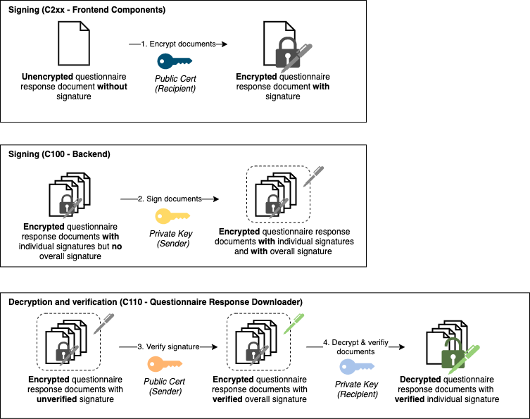

link:../README.adoc[← Table of Contents]

== Encryption Process

This document explains how encryption of questionnaire responses is implemented across the components C200 - Mobile App, C100 - Mobile Backend, C110 - Questionnaire Downloader. Questionnaire responses are encrypted to ensure data protection for their transmission to the receiving institution. Moreover, they are signed in order to guarantee that they are not tampered with during transmission from the Mobile Backend to the institution.

The following image visualizes the process that will be described in more detail hereafter.

=== Overview

==== Actors

There exist three actors in the encryption process.

1. Recipient: This is the institution which accesses questionnaire responses that are submitted by users of the mobile app. More specifically, a particular representative is the user of the questionnaire response downloader component.

2. Sender: This is the mobile backend, which sends questionnaire responses to the recipient.

3. Creator: This is the mobile app, which creates the questionnaire responses.

Only the first two actors own a personal key-pair, that is used by other actors in the process.

==== Mobile App - Encryption

A questionnaire response is encrypted by the mobile app in PKCS#7 syntax before it is transmitted to the mobile backend. 
The certificate of the recipient is used for this encryption.

==== Mobile Backend - Signing

The mobile backend application will sign every batch (one page) of encrypted questionnaire response objects which is requested via the download API. In order to ensure cross-platform compatibility, a standard conformant JSON Web Signature (JWS) is created by using the private sender key.

==== Questionnaire Response Downloader - Validation & Decryption

The signed and encrypted questionnaire responses are processed by the download script. First, the signature is verified by the use of the sender's certificate. Then, the validated responses are decrypted with the private key of the recipient.

==== Key Inventory

* Sender - Key pair
** public cert: is needed by the receiver (Questionnaire Response Downloader) to verify the signed documents
** private key: is used by the Mobile Backend and needs to be kept secret

* Receiver - Key pair
** public cert: is used by the Mobile Frontend to encrypt the documents
** private key: is needed by the receiver (Questionnaire Response Downloader) to decrypt the documents and needs to be kept secret
